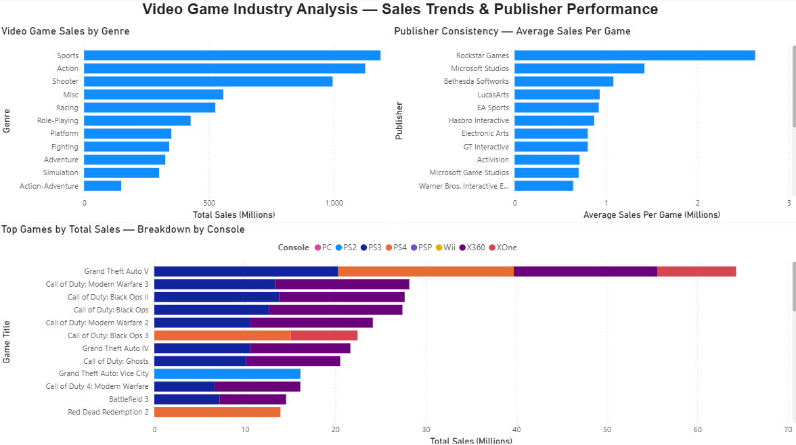

# Video Game Industry Analysis — Sales Trends & Publisher Performance

## Project Overview

This project analyzes over 64,000 video game sales records to answer a core business question:

**What makes a video game commercially successful — and how have sales trends shifted across genres, platforms, and publishers over time?**

Using SQL for data extraction and analysis, and Power BI for visualization, this project follows a complete end-to-end analytics workflow: raw data → exploration → analysis → insight → presentation.

---

## Tools Used

- **DB Browser for SQLite** — SQL querying and data exploration
- **Power BI Desktop** — data visualization and dashboard design
- **Kaggle** — dataset source
- **GitHub** — portfolio hosting and version control

---

## Dataset

**Source:** Video Game Sales 2024 by asaniczka (Kaggle)  
**Records:** 64,000+ games  
**Key columns:** title, console, genre, publisher, developer, critic_score, total_sales, na_sales, jp_sales, pal_sales, release_date

---

## Business Questions Answered

1. Which genres generate the most total sales — and is volume or quality driving that?
2. What are the best selling games of all time, and which platforms contributed to their success?
3. Which publishers are the most commercially consistent across their entire catalog?
4. Does a high critic score actually predict higher sales?
5. Are North American and Japanese markets buying the same games?

---

## Analytical Process

### Phase 1 — Data Exploration

Before writing any analysis queries, the dataset was explored to understand its structure, identify data quality issues, and inform the analytical approach.

**Key findings during exploration:**

- The dataset contains an **"Unknown" publisher** category with no attribution — excluded from all publisher analysis to maintain accuracy
- A significant number of records contained **zero sales values** representing missing data rather than actual zero sales — filtered out using `WHERE total_sales > 0`
- **Publisher naming inconsistencies** were identified: Namco, Namco Bandai, and Namco Bandai Games appear as separate publishers despite representing the same entity. Noted as a data limitation.
- **Nintendo's commercial footprint is understated** in this dataset — many major Nintendo titles are attributed to subsidiary developers (HAL Laboratory, Game Freak, Nintendo EAD) rather than Nintendo as publisher, causing their aggregate numbers to appear lower than their true market position

These findings are documented transparently as data limitations and informed all subsequent analytical decisions.

---

### Phase 2 — Core Analysis

#### Genre Sales Analysis
Identified total sales, game count, and average sales per game across all genres to distinguish between genres that sell well due to volume versus genuine per-title commercial strength.

**Finding:** Sports, Action, and Shooter genres dominate total sales. However when normalized by number of titles, the per-game average tells a more nuanced story about which genres consistently produce strong individual performers.

#### Top Games by Platform
Analyzed best selling titles with platform-level breakdowns to understand multi-platform commercial reach.

**Finding:** Grand Theft Auto V appears across PS3, PS4, and Xbox 360 — its combined cross-platform sales dwarf every other title in the dataset. Call of Duty titles occupy the majority of remaining top spots, with a heavy concentration on Xbox 360 suggesting a strong correlation between that platform and the COD audience during its peak era.

#### Publisher Consistency Analysis
This was the most analytically complex question: which publishers are genuinely consistent versus relying on one breakout hit to carry their catalog?

A custom metric — **outlier_gap** — was created by subtracting a publisher's average sales per game from their single best selling title. A large gap indicates one hit wonder behavior; a small gap indicates genuine consistency across the catalog.

**Finding:** Only 3 publishers in the entire dataset maintain an average of 1.0 million or more sales per game across 20+ titles — Rockstar Games, Microsoft Studios, and Bethesda Softworks. When the threshold is lowered to 0.5 million, 20 publishers qualify, revealing a clear tier structure in the industry.

**Rockstar Games** sits in a category of its own — the highest average sales per game by a significant margin, but also the largest outlier gap, driven almost entirely by the GTA franchise. Classic high-performing one hit wonder structure at scale.

---

### Phase 3 — Additional Exploratory Analysis

Beyond the three core business questions, several deeper investigative queries were conducted to follow surprising results and validate findings. This additional analysis is documented in `video_game_analysis.sql` and reflects real analytical practice — good analysts follow unexpected results rather than accepting surface-level findings.

**Ultra Games investigation:**
Ultra Games appeared at the top of the publisher consistency ranking with a surprisingly high average. Investigation revealed Ultra Games was a Konami subsidiary created specifically to circumvent Nintendo's publisher release limits. Their high average is driven almost entirely by the original Teenage Mutant Ninja Turtles NES release (4.17M units) across a small catalog — a textbook one hit wonder hidden behind an unfamiliar publisher name. Also notable: Ultra Games published the original NES version of Metal Gear, one of the most historically significant game franchises ever created.

**Nintendo investigation:**
Nintendo's absence from the top publisher rankings was investigated. Results confirmed their name is stored consistently as "Nintendo" with no naming variants — ruling out a data quality explanation. The actual cause is attribution: Nintendo's biggest commercial titles (Mario, Pokemon, Zelda) are credited to subsidiary developers in this dataset rather than Nintendo as publisher, causing a significant understatement of their true commercial footprint. This is flagged as a meaningful data limitation for anyone using this dataset for publisher-level analysis.

**Critic score vs sales correlation:**
Preliminary analysis explored whether critic scores predict commercial performance. Results suggest the relationship is weaker than commonly assumed — several low-scored titles outperformed critically acclaimed games commercially, particularly in the sports and shooter genres where franchise loyalty appears to override review scores.

---

## Dashboard

The final dashboard presents three visualizations on a single page:

- **Video Game Sales by Genre** — horizontal bar chart showing total sales by genre, sorted descending
- **Publisher Consistency — Average Sales Per Game** — horizontal bar chart showing the top 20 publishers by average sales per game, filtered to publishers with 20+ titles and 0.5M+ average sales
- **Top Games by Total Sales — Breakdown by Console** — stacked horizontal bar chart showing best selling titles with console contribution segments color coded by platform

---

## Key Findings Summary

| Finding | Insight |
|---------|---------|
| Genre dominance | Sports, Action, and Shooter lead total sales |
| Platform loyalty | COD audience concentrated on Xbox 360; GTA audience spans all platforms |
| Publisher consistency | Only 3 publishers clear the 1M avg sales threshold across 20+ games |
| One hit wonders | Rockstar has highest avg sales but largest outlier gap — GTA dependent |
| Data quality | Nintendo understated due to developer attribution inconsistencies |
| Critic scores | Weak predictor of commercial success in high-volume genres |

---

## Data Limitations

- Unknown publisher records excluded from all publisher analysis
- Zero sales values treated as missing data and excluded
- Publisher naming inconsistencies exist throughout the dataset
- Nintendo's commercial presence is significantly understated due to developer vs publisher attribution
- Sales figures represent physical and tracked digital sales only — may not capture full digital distribution

---

## SQL Skills Demonstrated

- SELECT, WHERE, GROUP BY, ORDER BY, LIMIT
- Aggregate functions: SUM, AVG, COUNT, MAX, MIN, ROUND
- HAVING clause for post-aggregation filtering
- CASE WHEN for conditional categorization
- Calculated columns and custom metrics
- Subqueries and analytical thinking
- Data quality filtering and NULL handling
- Investigative follow-up queries based on unexpected results

---

## How to Reproduce

1. Download the dataset from Kaggle: search "Video Game Sales 2024" by asaniczka
2. Import the CSV into DB Browser for SQLite
3. Run queries from `video_game_analysis.sql`
4. Export results as CSVs
5. Load CSVs into Power BI Desktop
6. Build visualizations following the dashboard layout above

---

## About

This project was built as part of a data analyst portfolio focusing on real-world business questions applied to personally interesting subject matter. The analytical approach prioritizes insight communication over technical complexity — every query exists to answer a specific business question, not to demonstrate syntax.

*Bryce — Data Analyst | Atlanta, GA | Open to remote opportunities*
