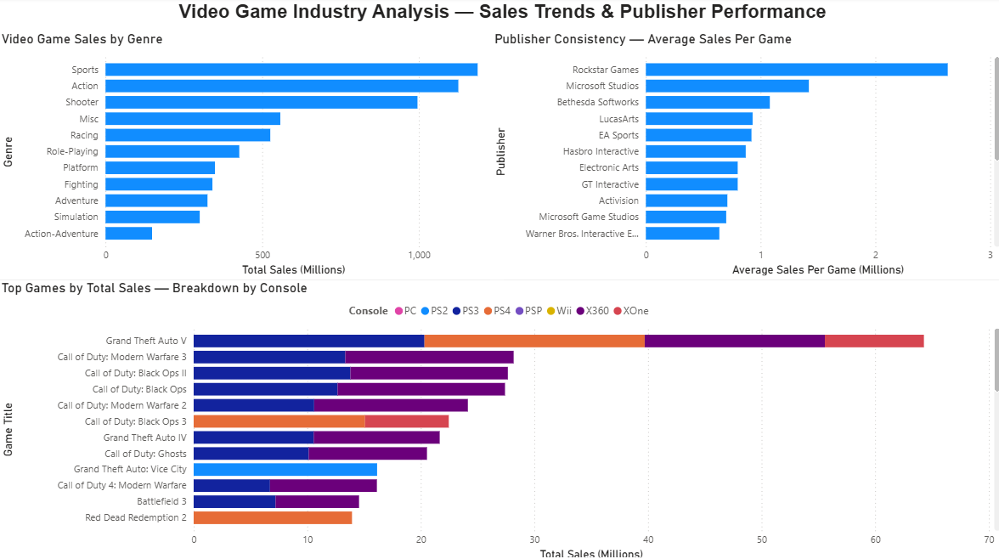

# 🎮 Video Game Industry Analysis: Sales Trends & Publisher Performance
### Project 1 of 5 | Tools: SQL · Power BI

A data analysis project investigating what actually makes a video game commercially successful — and whether the publishers with the biggest reputations have the data to back it up. Built with SQLite and Power BI across 64,000+ game records, uncovering surprises in genre rankings, publisher consistency, and one Nintendo mystery that took three queries to solve.

---

## Tools Used
| Tool | Purpose |
|---|---|
| SQLite | Database storage and querying |
| DB Browser for SQLite | SQL query interface |
| Power BI Desktop | Interactive dashboard and visualizations |
| Kaggle | Dataset source |

---

## The Story

### The Question
I've been playing video games my whole life. I know GTA V is massive. I know Call of Duty prints money. I know Nintendo is iconic. But knowing something casually and being able to prove it with data are two very different things.

**Core question:** What actually makes a video game commercially successful — and do the publishers with the biggest reputations have the data to back it up?

---

### Dashboard — Video Game Sales by Genre
Sports beats Action. The genre most people assume dominates actually gets edged out by Sports in total sales — not by much, but enough to be surprising. GTA V's bar on the top games chart is nearly double the next closest title, appearing across PS3, PS4, and Xbox 360 as three separate top-tier entries. Call of Duty titles dominate the remainder of the list, their concentration on Xbox 360 telling a clear story about who their core audience was during their peak era.



---

## Key Findings

- 🎮 **Sports beats Action** — the genre most people assume dominates gets edged out by Sports in total sales
- 💿 **GTA V is in a league of its own** — its bar is nearly double the next closest title, appearing across three separate platforms
- 📞 **Call of Duty is relentless** — COD titles dominate the top games list, concentrated on Xbox 360 during their peak era
- 🏆 **Only 3 publishers clear the consistency bar** — when filtering to publishers with 20+ games AND average sales above 1M per title, only Rockstar Games, Microsoft Studios, and Bethesda Softworks qualify
- 🎲 **Rockstar is the ultimate paradox** — highest average sales per game by a wide margin, but the largest outlier gap too. GTA carries their entire catalog
- 🕵️ **Ultra Games is not what it looks like** — they ranked near the top of the consistency chart. Investigation revealed a Konami shell company created to get around Nintendo's publisher release limits, propped up by TMNT and the original Metal Gear
- 🍄 **Nintendo's data has a hidden problem** — Nintendo barely registers as a publisher despite being one of gaming's most iconic companies. Mario, Pokemon, and Zelda titles are credited to subsidiary developers rather than Nintendo as publisher. Their true commercial footprint is significantly understated
- ⭐ **Critic scores are a weak predictor of sales** — franchise loyalty in Sports and Shooter genres drives purchasing decisions far more than review scores

---

## Analytical Process

### Phase 1 — Data Exploration
Before writing any analysis queries the dataset was explored to understand its structure and identify data quality issues.

Key decisions made:
- "Unknown" publisher records excluded from all publisher analysis — no attribution means no insight
- Zero sales values filtered out using `WHERE total_sales > 0` — these represent missing data, not actual zero sales
- Publisher naming inconsistencies flagged — Namco, Namco Bandai, and Namco Bandai Games appear as separate entries despite being the same entity

### Phase 2 — Core Analysis
**Genre Sales** — total sales, game count, and average per title across all genres to separate volume-driven success from genuine per-game commercial strength.

**Top Games by Platform** — best selling titles with platform-level breakdowns to understand multi-platform reach, leading to the stacked bar chart showing console contribution per title.

**Publisher Consistency** — a custom metric, `outlier_gap`, was created by subtracting a publisher's average sales per game from their single best selling title. Large gap = one hit wonder. Small gap = genuine consistency across the catalog.

### Phase 3 — Investigative Follow-Up
Good analysts follow unexpected results rather than accepting surface-level findings.

**The Ultra Games rabbit hole:** They appeared at the top of the consistency ranking with no obvious reason. Querying their full catalog revealed a Konami subsidiary propped up by TMNT and Metal Gear — a one hit wonder hidden behind an unfamiliar name.

**The Nintendo investigation:** Their absence from top publisher rankings triggered a two-query investigation. Pulling their top 20 titles confirmed none of their iconic franchises appeared — the absence of Mario Kart, Super Mario Bros, and Pokemon from Nintendo's publisher record is a meaningful data quality finding for anyone using this dataset.

**The critic score test:** Explored whether high review scores predict commercial performance. The relationship is weaker than most gamers would assume.

---

## SQL Skills Demonstrated

**Genre totals:**
```sql
SELECT genre,
       ROUND(SUM(total_sales), 2) AS total_sales_millions,
       COUNT(*) AS num_games
FROM vgsales
WHERE total_sales > 0
AND genre IS NOT NULL
GROUP BY genre
ORDER BY total_sales_millions DESC;
```

**Publisher consistency with custom outlier metric:**
```sql
SELECT publisher,
       COUNT(*) AS num_games,
       ROUND(AVG(total_sales), 2) AS avg_sales,
       ROUND(MAX(total_sales), 2) AS best_seller,
       ROUND(MAX(total_sales) - AVG(total_sales), 2) AS outlier_gap
FROM vgsales
WHERE publisher IS NOT NULL
AND publisher != 'Unknown'
AND total_sales > 0
GROUP BY publisher
HAVING COUNT(*) >= 20
AND AVG(total_sales) >= 0.5
ORDER BY avg_sales DESC
LIMIT 20;
```

**Full skills used:** SELECT, WHERE, GROUP BY, ORDER BY, LIMIT, HAVING, SUM, AVG, COUNT, MAX, MIN, ROUND, calculated columns, NULL handling, investigative follow-up queries

---

## Project Structure
```
video-game-sales-analysis/
│
├── video_game_analysis.sql      # All SQL queries with comments
├── genre_summary.csv            # Genre sales export
├── top20_games.csv              # Top games by console export
├── publisher_consistency.csv    # Publisher consistency export
└── dashboard_screenshot.png     # Final Power BI dashboard
```

---

## Dataset
| Detail | Info |
|---|---|
| Source | Video Game Sales 2024 by asaniczka (Kaggle) |
| Records | 64,000+ games |
| Key columns | title, console, genre, publisher, developer, critic_score, total_sales, na_sales, jp_sales, pal_sales, release_date |

---

## Data Limitations
- Unknown publisher records excluded — cannot be attributed to a specific entity
- Zero sales values treated as missing data throughout
- Publisher naming inconsistencies exist — Namco family is the clearest example
- Nintendo's commercial presence significantly understated due to developer vs publisher attribution
- Sales figures may not capture full digital distribution for newer titles

---

## How to Run
1. Download the dataset from Kaggle — search "Video Game Sales 2024" by asaniczka
2. Import the CSV into DB Browser for SQLite as a table named `vgsales`
3. Run queries from `video_game_analysis.sql`
4. Export results as CSVs using File → Export → Results to CSV
5. Load CSVs into Power BI Desktop and build visualizations

---

## Author
Bryce Gardner
- GitHub: [brycegardner90](https://github.com/brycegardner90)
- LinkedIn: [Bryce Gardner](https://www.linkedin.com/in/bryce-gardner-16a889183)

---

## Portfolio Navigation

| Project | Topic | Tools |
|---|---|---|
| **Project 1 — Video Game Sales Analysis** *(you are here)* | Global video game sales trends (1980–2020) | SQL · Power BI |
| [Project 2 — NFL Penalty Bias Analysis](https://github.com/brycegardner90/nfl-penalty-analysis) | Do certain NFL teams get more blown calls? | Python · SQL · Power BI |
| [Project 3 — Atlanta Rising](https://github.com/brycegardner90/Atlanta-Rising-A-Century-of-Growth) | Atlanta's century of economic & demographic growth | Python · SQLite · Power BI |
| [Project 4 — Restaurant Industry Analysis](https://github.com/brycegardner90/restaurant-industry-analysis) | U.S. restaurant industry financial analysis 2000–2024 | Google Sheets · SQLite · Tableau |
| [Project 5 — The Forsyth Boom](https://github.com/brycegardner90/Forsyth-Boom) | Forsyth County small business & growth analysis | Python · SQLite · Tableau |
